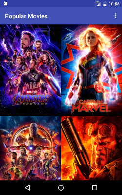

# PopularMovies2
Popular Movies app (Stage 2 implementation) is done as a part of Udacity's Android Developer course that displays the most popular or top rated movies with the functionality of saving favorite movies. This app lets you play trailers, read reviews of a selected movie. An API key is required to run this app. The code is written in Java. 

Instructions for running the app:
- Include an API key from themoviedb.org in the 'gradle.properties'.

 |  

